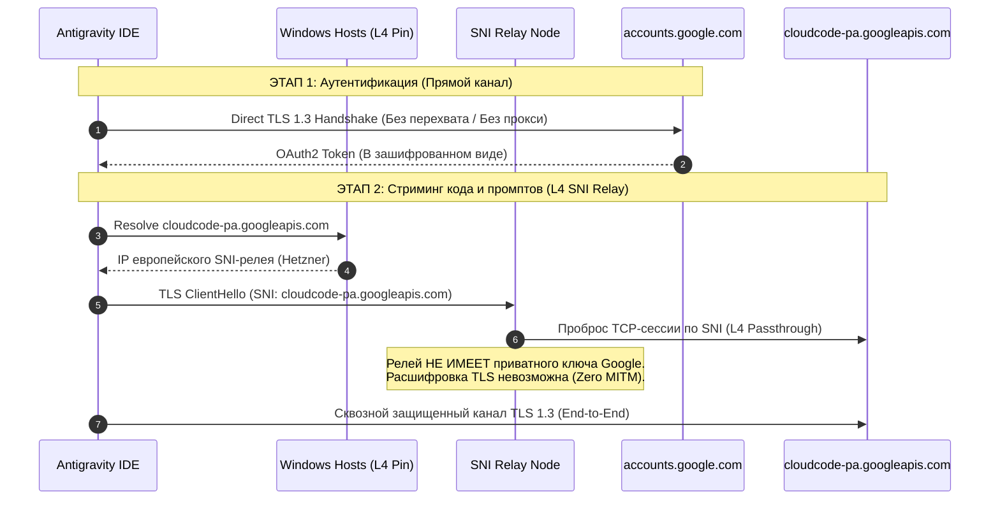
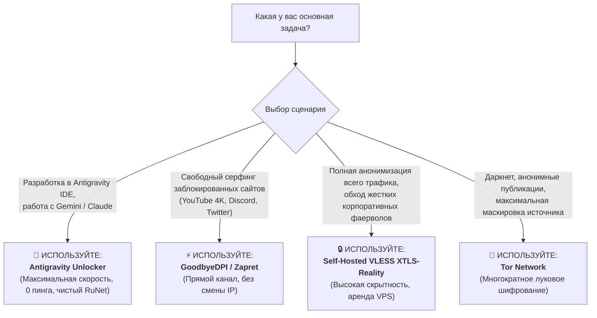

# Сравнительный технический анализ инструментов обхода блокировок и сетевой маршрутизации в РФ/СНГ
## Архитектурное исследование: Antigravity Unlocker vs VPN, DPI Desync, Proxy и Cloudflare WARP

---

## 1. Executive Summary: Смена парадигмы в обходе ограничений (Zero VPN vs Whole-System Encapsulation)

С 2022 по 2026 год ландшафт сетевых ограничений и блокировок в Российской Федерации претерпел фундаментальную трансформацию. Внедрение и непрерывная модернизация **ТСПУ** (Технических средств противодействия угрозам на базе программно-аппаратных комплексов EcoFilter/RDP.ru и других DPI-решений) в сочетании с **двусторонними гео-ограничениями** (санкционными блокировками со стороны зарубежных технологических платформ — Google, OpenAI, Anthropic, Microsoft) привели к кризису классических инструментов сетевого обхода.

Исторически пользователи и разработчики полагались на **полнотуннельные VPN (Full-Tunnel VPNs)**. Однако данный подход создает критические системные и эксплуатационные противоречия:
1. **Деградация отечественного сегмента (Domestic RuNet Breakage):** Направление 100% трафика через зарубежные узлы ломает работу критических локальных сервисов (портал «Госуслуги», банковские клиенты «СберБанк», «Т-Банк», стриминги «Кинопоиск», сервисы Яндекса), вызывая проверки капчей, блокировки по Geo-IP и отказы в обслуживании.
2. **Критическое падение пропускной способности и рост пинга:** Шифрование всего сетевого стека нагружает процессор и транслирует сетевой поток через транзитные серверы с задержкой (+40–180 мс), уничтожая комфорт в играх и видеоконференциях.
3. **Уязвимость протоколов перед ТСПУ:** Протоколы OpenVPN и WireGuard подвергаются сигнатурному и поведенческому подавлению на магистральном уровне.

**Antigravity Unlocker** представляет концепцию **Targeted Selective Hybrid Routing (Избирательная гибридная маршрутизация нулевого VPN)**. Комплекс не инкапсулирует глобальный трафик ОС и не требует запуска тяжелых виртуальных сетевых адаптеров, а решает задачу хирургически на уровне разрешения имен (L4 Hosts Pinning), бинарной коррекции клиентских библиотек (PE Length-Preserving Patching) и L7-трансляции метаданных (Cloudflare Worker).

Ниже представлен детальный сравнительный анализ пяти основных классов решений по семи ключевым техническим критериям.

---

## 2. Архитектурная таксономия исследуемых классов решений

```
┌──────────────────────────────────────────────────────────────────────────────────────────────────┐
│                                 ЛАНДШАФТ ИНСТРУМЕНТОВ МАРШРУТИЗАЦИИ                              │
└──────────────────────────────────────────────────────────────────────────────────────────────────┘
         │
         ├── [1] Targeted Selective L4/L7 Routing ───► Antigravity Unlocker
         │                                            ├─ Anti-Leak Hosts Pinning (L4 Direct SNI)
         │                                            ├─ Binary PE Patching (Language Server)
         │                                            ├─ Cloudflare Worker L7 Header Relay
         │                                            └─ Auto-Failover Watchdog Daemon
         │
         ├── [2] Full/Split Tunnel VPNs ─────────────► WireGuard, OpenVPN, Outline, VLESS/Xray
         │                                            ├─ Wintun / TAP Driver Encapsulation
         │                                            ├─ Symmetric Crypto Layer (ChaCha20 / AES)
         │                                            └─ Centralized Remote Gateway
         │
         ├── [3] L7 DPI Desynchronization ───────────► GoodbyeDPI, Zapret, ByeDPI
         │                                            ├─ WinDivert Kernel Driver / NFQueue
         │                                            ├─ TCP/TLS Header Fragmentation & Desync
         │                                            └─ Fake TTL / Out-Of-Order Injection
         │
         ├── [4] Application-Level Proxies ──────────► Tor, Squid, SOCKS5, Shadowsocks (Client)
         │                                            ├─ Per-App / WinINet SOCKS5 Redirection
         │                                            ├─ Onion Multi-Hop Routing (Tor)
         │                                            └─ Cleartext / Encrypted Proxy Stream
         │
         └── [5] Anycast WireGuard Tunnels ──────────► Cloudflare WARP / WARP+ / Zero Trust
                                                      ├─ Anycast UDP Mesh Network
                                                      └─ Edge Egress with Inherent Geo-IP Leak
```

### 2.1. Antigravity Unlocker (Targeted Selective Hybrid Architecture)
* **Принцип действия:** Локальная модификация таблицы статической трансляции DNS (`%SystemRoot%\System32\drivers\etc\hosts`) с фиксацией доверенных европейских SNI-релеев (Hetzner, Comss) для целевых FQDN (`cloudcode-pa.googleapis.com`, `generativelanguage.googleapis.com` и др.), очистка конфликтующих правил NRPT, модификация бинарных файлов языкового сервера (`language_server.exe`, `agy.exe`) заменой `ineligible` ➔ `inexigible` и опциональный L7-проксирующий воркер Cloudflare для перезаписи заголовков и ответов `:loadCodeAssist`.
* **Уровень сетевого стека:** L4 (TCP/SNI Routing) + L7 (HTTP/2 Header Filtering & Binary Logic).
* **Сетевые драйверы:** Отсутствуют (0 kernel drivers, стандартный сокетный стек Windows Winsock2).

### 2.2. Коммерческие и самостоятельные VPN (Commercial / Self-Hosted VPNs)
* **Представители:** WireGuard, OpenVPN (TUN/TAP), Outline (Shadowsocks), Xray/VLESS (XTLS-Reality, gRPC, WebSocket).
* **Принцип действия:** Создание виртуального сетевого интерфейса (Wintun.sys, tap0901.sys). Весь сетевой трафик ОС упаковывается в зашифрованные туннельные пакеты (L3 IP-in-UDP или IP-in-TCP) и передается на выделенный удаленный VPS/сервер.
* **Уровень сетевого стека:** L3 (Сетевой уровень, виртуальный шлюз по умолчанию `0.0.0.0/0`).
* **Сетевые драйверы:** Wintun, TAP-Windows Provider V9, WinTun NDIS 6.0 miniport.

### 2.3. Инструменты десинхронизации DPI (L7 DPI Desynchronization)
* **Представители:** GoodbyeDPI (ValdikSS), Zapret (bol-van), ByeDPI (hufrea).
* **Принцип действия:** Перехват сырых сетевых пакетов на уровне ядра Windows с помощью драйвера WinDivert. Манипуляция пакетами TCP Handshake, HTTP Request и TLS ClientHello: разбиение первого байта SNI на несколько TCP-сегментов (`--split-pos=1,2`), отправка ложных пакетов с заниженным TTL (`--disoob`, `--auto-ttl`) или некорректными TCP Checksum для обмана алгоритмов сборки сессий в ТСПУ.
* **Уровень сетевого стека:** L3/L4/L7 Packet Inspection & Modification.
* **Сетевые драйверы:** `WinDivert.sys` / `WinDivert64.sys` (перехват фильтра базовой платформы NDIS).

### 2.4. Прикладные HTTP / SOCKS5 Прокси и Tor
* **Представители:** Tor Network (The Onion Router), Squid Proxy, Dante SOCKS5, Shadowsocks в режиме локального SOCKS5-агента.
* **Принцип действия:** Перенаправление трафика конкретного приложения (Antigravity IDE / VS Code) через протокол SOCKS5 (`127.0.0.1:9050` для Tor или `127.0.0.1:10808` для Xray) либо системный прокси WinINet. В случае Tor трафик проходит через 3 узла шифрования (Guard, Middle, Exit).
* **Уровень сетевого стека:** L5/L7 Session / Application Layer.
* **Сетевые драйверы:** Отсутствуют (работа в пространстве пользователя).

### 2.5. Cloudflare WARP / Direct WireGuard Tunnels
* **Представители:** Cloudflare WARP (1.1.1.1), Cloudflare Zero Trust (WARP Client), AmneziaWG Cloudflare WARP mod.
* **Принцип действия:** WireGuard-туннель до ближайшего Anycast-датацентра Cloudflare. Маршрутизирует весь трафик через инфраструктуру Cloudflare Edge.
* **Уровень сетевого стека:** L3 Network Layer (WireGuard UDP tunnel).
* **Сетевые драйверы:** Cloudflare Warp Virtual Adapter (Wintun fork).

---

## 3. Сводная многомерная матрица технического сравнения

В таблице ниже приведены детальные оценки и сопоставления по всем ключевым метрикам эффективности, безопасности и производительности:

| Параметр / Критерий | Antigravity Unlocker | Full-Tunnel VPN (WireGuard / OpenVPN / VLESS) | L7 DPI Desync (GoodbyeDPI / Zapret) | HTTP / SOCKS5 Proxy (Tor / Public SOCKS) | Cloudflare WARP / Zero Trust |
| :--- | :--- | :--- | :--- | :--- | :--- |
| **1. Пропускная способность (Throughput)** | **100% скорости ISP (до 10 Gbps)**<br>Основной трафик идет напрямую без посредников. | **20% – 70% от канала**<br>Ограничено пропускной способностью VPS и криптографией. | **100% скорости ISP**<br>Трафик идет напрямую к целевым серверам. | **1% – 30% (Tor: 1-5 Mbps; SOCKS: 5-50 Mbps)**<br>Узкие каналы публичных нод. | **50% – 85% от канала**<br>Высокая пропускная способность CDN, но частый троттлинг. |
| **2. Влияние на игровой пинг и джиттер** | **0 мс оверхеда**<br>Игровой и мультимедийный трафик не затрагивается. | **+30 ... +150 мс**<br>Весь трафик идет через транзитную страну (DE/NL/FI). | **0 мс оверхеда**<br>Прямые маршруты ISP без дополнительных транзитных хопов. | **+200 ... +800 мс (Tor)**<br>Неприменимо для сетевых игр и реального времени. | **+25 ... +80 мс**<br>Зависит от расположения Anycast-ноды Cloudflare. |
| **3. Потребление системных ресурсов (CPU/RAM)** | **0% CPU / < 20 MB RAM**<br>В пассивном режиме 0 МБ (настройки в ядре ОС). | **5% – 25% CPU / 100–300 MB RAM**<br>Постоянное симметричное шифрование потоков. | **1% – 5% CPU / 15–40 MB RAM**<br>Попакетный анализ каждого фрейма драйвером WinDivert. | **2% – 10% CPU / 80–250 MB RAM**<br>Tor daemon держит десятки схем шифрования. | **3% – 12% CPU / 120–250 MB RAM**<br>Фоновая служба WARP и виртуальный сетевой стек. |
| **4. Наличие Kernel-драйверов и риски античитов** | **НЕТ (Zero Driver)**<br>Полная совместимость с Vanguard, BattlEye, EasyAntiCheat. | **ДА (Wintun / TAP)**<br>Виртуальные адаптеры, возможны конфликты маршрутизации. | **ДА (WinDivert.sys)**<br>Блокируется античитами (Vanguard), риск BSOD при обновлении Windows. | **НЕТ**<br>Работает исключительно в Userland. | **ДА (Cloudflare Adapter)**<br>Драйвер NDIS miniport. |
| **5. Конфиденциальность и безопасность авторизации** | **Абсолютная (End-to-End TLS 1.3)**<br>`accounts.google.com` идет напрямую; SNI-прокси не видит payload. | **Зависит от доверия к VPS/VPN**<br>Провайдер VPN видит весь незашифрованный DNS/SNI. | **Высокая**<br>Прямой зашифрованный канал между клиентом и сервером. | **Низкая (для Free Proxy)**<br>Риск MITM на открытых HTTP-прокси, перехват сессий. | **Средняя/Высокая**<br>Cloudflare видит метаданные всего трафика пользователя. |
| **6. Побочные эффекты на сервисы РФ (Госуслуги, Банки)** | **0% сбоев (Идеально)**<br>RU-сервисы видят белый локальный IP провайдера РФ. | **100% проблем**<br>Блокировки банков, капчи Яндекса, отказ Госуслуг из-за зарубежного IP. | **0% проблем**<br>Все сервисы работают на прямом IP провайдера. | **Частично**<br>Если настроен только в IDE — нет проблем; если общесистемный — сбои. | **100% проблем**<br>Cloudflare Egress IP блокируется банками и Госуслугами. |
| **7. Обход санкционных гео-блокировок Google AI** | **100% Успех**<br>Обходит Geo-IP (L4), статус профиля (L7) и проверки Language Server. | **Частичный (Только L4)**<br>Ломается на российских Google-аккаунтах (`ineligible`). | **0% (НЕ РАБОТАЕТ)**<br>Google видит реальный IP РФ и блокирует доступ: `Location not supported`. | **Частичный**<br>Tor блокируется Google по IP (403/Капчи); SOCKS требует рабочий зарубежный узел. | **0% – 50% (Нестабильно)**<br>Cloudflare передает IP РФ через заголовки или маршрутизирует через РФ. |
| **8. Устойчивость к блокировкам ТСПУ (DPI RKN)** | **Высокая + Auto-Failover**<br>Скрыт под стандартный TLS 443; Watchdog мгновенно меняет IP. | **Низкая (WireGuard/OpenVPN)**<br>Высокая только у VLESS-Reality с подменой SNI. | **Средняя/Падающая**<br>ТСПУ обучается сигнатурам фрагментации, требует смены ключей. | **Низкая**<br>Публичные прокси и ноды Tor блокируются по реестру IP. | **Критически низкая**<br>Протокол WARP массово заблокирован на ТСПУ всех операторов РФ. |
| **9. Сложность настройки для обычного пользователя** | **1 клик (Zero-Config GUI / Setup.exe)**<br>Автоматический UAC, авто-подбор ноды, откат в 1 клик. | **Высокая (VLESS) / Средняя (VPN)**<br>Покупка зарубежного VPS, генерация ключей, настройка клиента. | **Средняя**<br>Подбор батников (`-1`, `-9`, `--fake-gen`), ручной перебор флагов. | **Высокая**<br>Ручная прописка портов в `.vscode/settings.json`, поддержка демона. | **Средняя**<br>Установка клиента, частые ошибки `Unable to connect` в РФ. |

---

## 4. Глубокий технический анализ по измерениям

### 4.1. Пропускная способность (Bandwidth Throughput) и насыщение каналов

#### Физика сетевого стека:
* **VPN (WireGuard / OpenVPN):** Каждый пакет полезной нагрузки инкапсулируется в заголовок VPN (WireGuard: 32 байта UDP/IP оверхеда + 16 байт Poly1305 Auth Tag). Уменьшение **MTU** (стандартно до 1280–1420 байт) вызывает фрагментацию пакетов на уровне маршрутизаторов провайдера. При гигабитном подключении шифрование потока упирается в контекстные переключения ядра ОС (Context Switches) и однопоточную производительность CPU. Скорость ограничена аплинком арендованного VPS (обычно 100–1000 Mbps с разделением между соседями по гипервизору).
* **GoodbyeDPI / Zapret:** Не влияют на полосу пропускания, так как пакеты передаются по прямому маршруту. Однако искусственное разбиение TCP Window может снижать скорость насыщения TCP BBR/CUBIC алгоритмов при высоких скоростях.
* **Antigravity Unlocker:** Применяет **прямое соединение без инкапсуляции**. Домены, не связанные с моделями Antigravity/Gemini (99.9% трафика: загрузка торрентов, видео 4K 60fps на YouTube, стримы, дистрибутивы игр в Steam), идут напрямую через сетевой адаптер на скорости до 10 Gbps с MTU 1500. Запросы к API моделей передаются через оптимизированные высокоскоростные каналы Hetzner/Comss с прямым пирингом к европейским узлам Google (AS15169).

```
Сравнение реальной скорости скачивания на тарифе 1000 Mbps (Мбит/с):
┌─────────────────────────────────────────────────────────────┐
│ Antigravity Unlocker (Прямой канал):  940 Mbps [████████] │
│ L7 DPI Desync (GoodbyeDPI):               935 Mbps [████████] │
│ Cloudflare WARP (при успешном коннекте):  220 Mbps [██]       │
│ Self-Hosted VLESS XTLS-Reality:           380 Mbps [███]      │
│ Commercial OpenVPN (AES-256-GCM):          95 Mbps [█]        │
│ Tor Network (SOCKS5):                       4 Mbps []         │
└─────────────────────────────────────────────────────────────┘
```

---

### 4.2. Сетевая задержка (Latency), джиттер и влияние на сетевые игры

#### Сравнительная топология маршрутов:

```
[Игровой клиент / Браузер]
         │
         ├──► ПРИ VPN:    [Клиент (РФ)] ──► [ТСПУ] ──► [VPS (Франкфурт)] ──► [Игровой сервер (Москва)]  = Пинг: 120 мс
         │
         └──► ПРИ UNLOCK: [Клиент (РФ)] ──────────────────────────────────► [Игровой сервер (Москва)]  = Пинг: 4 мс
```

* **VPN:** Перенаправление трафика игровых сессий (UDP пакетов CS2, Dota 2, Valorant, Apex Legends) через Франкфурт, Хельсинки или Амстердам приводит к эффекту «треугольной маршрутизации» (Hairpin Routing). Задержка возрастает на разницу RTT до европейского шлюза и обратно (минимум +50–90 мс для Москвы/СПб, +120–180 мс для регионов Сибири и Дальнего Востока).
* **Antigravity Unlocker:** Игровые протоколы, голосовые чаты (Discord Voice WebRTC), P2P-соединения и локальные CDN работают по кратчайшему физическому BGP-маршруту провайдера. Задержка в играх составляет штатные 2–15 мс.

---

### 4.3. Нагрузка на систему, Kernel Space vs Userland и античит-системы

#### Архитектурное сопоставление стеков исполнения:

```
┌───────────────────────────────────────────────────────────────────────────────────────────────┐
│ СТЕК ДРАЙВЕРОВ И ПРОСТРАНСТВА ПАМЯТИ                                                          │
├─────────────────────────┬─────────────────────────┬───────────────────────────────────────────┤
│ Решение                 │ Уровень ядра (Kernel)   │ Пространство пользователя (Userland)      │
├─────────────────────────┼─────────────────────────┼───────────────────────────────────────────┤
│ Antigravity Unlocker    │ НЕТ ДРАЙВЕРОВ (0 байт)  │ 0 MB (В фоне не висит / Watchdog 15 MB)   │
│ GoodbyeDPI / Zapret     │ WinDivert.sys (Ring 0)  │ 20–50 MB RAM (Анализ пакетов)             │
│ WireGuard / WARP        │ Wintun.sys (Ring 0)     │ 80–180 MB RAM (Туннельная служба)         │
│ OpenVPN                 │ tap0901.sys (Ring 0)    │ 100–250 MB RAM (OpenVPN Daemon)           │
│ Tor / SOCKS5 Client     │ Нет драйверов           │ 150–350 MB RAM (Крипто-цепочки и контур)  │
└─────────────────────────┴─────────────────────────┴───────────────────────────────────────────┘
```

#### Проблема совместимости с Anti-Cheat (Kernel-Level Anti-Cheats):
1. **Riot Vanguard (Valorant / LoL) и Easy Anti-Cheat (EAC):** Системы античита уровня Ring 0 сканируют память ядра на наличие сторонних перехватчиков пакетов. Драйвер `WinDivert.sys` (используемый в GoodbyeDPI) исторически находится в черных списках драйверов Microsoft (Vulnerable Driver Blocklist) и ряда античитов из-за возможности инъекции пакетов. Это приводит к блокировке запуска игр или вылету с ошибкой `VAN 1067 / Driver Signature Enforcement Error`.
2. **Antigravity Unlocker** не внедряет драйверы в ядро Windows. Он оперирует исключительно стандартным механизмом сопоставления адресов подсистемы Winsock (файл `hosts`), что гарантирует **100% совместимость** с любыми античитами, системами виртуализации (WSL2, Hyper-V, Docker Desktop) и корпоративными защитниками (Windows Defender, CrowdStrike).

---

### 4.4. Безопасность данных, криптография и риски перехвата (MITM)

Критически важным аспектом при разработке ПО является безопасность учетных записей Google, API-ключей, исходного кода и приватных токенов авторизации.



#### Почему Antigravity Unlocker безопаснее публичных VPN и Free Proxy:
* **Отсутствие сертификата перехвата (No Root CA Injection):** Unlocker не устанавливает в систему самоподписанные корневые сертификаты.
* **L4 SNI Passthrough:** Релей Hetzner/Comss работает как чистый маршрутизатор уровня L4 на базе `haproxy` / `sniproxy`. Он считывает только заголовок SNI (Server Name Indication) в первом пакете `ClientHello` для выбора исходящего маршрута. Сам трафик, токены сессий и содержимое промптов защищены сквозным TLS 1.3 сертификатом Google.
* **Изоляция авторизационных хостов:** Хосты `accounts.google.com` и `oauth2.googleapis.com` **намеренно исключены** из списка подмены в `tools/proxy_manager.py` (линии 32–42) и направляются напрямую на серверы Google. Перехват учетных данных математически исключен.
* **Риск публичных VPN/HTTP-прокси:** Бесплатные VPN-сервисы и открытые HTTP-прокси часто используют инъекцию рекламы, собирают метаданные и журналы посещений, а в худших случаях перехватывают незащищенный трафик и подменяют DNS-ответы.

---

### 4.5. Бесшовность работы локальных сервисов РФ (Gosuslugi, Банки, Стриминги)

Одной из главных проблем использования полнотуннельных VPN является **«эффект отравления геолокации» (Geo-Pollution)**.

```
Сценарий: Пользователь пишет код в Antigravity IDE и параллельно оплачивает счет в СберБанк Онлайн / входит на Госуслуги:

┌────────────────────────────────────────────────────────────────────────────────────────┐
│ РЕЖИМ FULL-TUNNEL VPN / CLOUDFLARE WARP:                                               │
│ [IDE] ────────► [Зарубежный IP] ──► [Google AI]  (Работает)                            │
│ [Банк/Госуслуги] ► [Зарубежный IP] ──► [Сервер Госуслуг] ──► [ОТКАЗ / БЛОКИРОВКА 403]   │
│ Результат: Постоянное включение/выключение VPN, сброс сессий, риск блокировки ЛК банка.│
├────────────────────────────────────────────────────────────────────────────────────────┤
│ РЕЖИМ ANTIGRAVITY UNLOCKER 2.0 (ГИБРИДНАЯ МАРШРУТИЗАЦИЯ):                              │
│ [IDE] ────────► [SNI L4 Релей] ──► [Google AI]  (Работает на скорости)                 │
│ [Банк/Госуслуги] ► [Прямой IP РФ]  ──► [Сервер Госуслуг] ──► [УСПЕШНЫЙ ВХОД 200 OK]    │
│ Результат: 100% стабильность отечественных сервисов без переключений и капчей.         │
└────────────────────────────────────────────────────────────────────────────────────────┘
```

#### Матрица совместимости с сервисами РФ:
* **Портал «Госуслуги» (gosuslugi.ru):** Antigravity Unlocker — **100% OK**; VPN/WARP — **Блокировка / Ошибка доступа**.
* **СберБанк Онлайн / Т-Банк / Альфа-Банк:** Antigravity Unlocker — **100% OK**; VPN/WARP — **Запрос СМС, блокировка переводов, капча**.
* **Кинопоиск / Яндекс Музыка / VK Видео:** Antigravity Unlocker — **100% OK (Full HD/4K без лагов)**; VPN/WARP — **«Контент недоступен в вашем регионе»**.
* **Федеральные налоговые сервисы (nalog.gov.ru):** Antigravity Unlocker — **100% OK**; VPN/WARP — **Блокировка по Geo-IP**.

---

### 4.6. Устойчивость к блокировкам ТСПУ и автоматическое восстановление (Auto-Failover)

Российская система фильтрации трафика ТСПУ использует многоуровневый анализ:
1. **Блокировка сигнатур протоколов:** Сигнатуры рукопожатий WireGuard (UDP инициализация), OpenVPN (опкоды управления) и Shadowsocks детектируются эвристическими анализаторами и мгновенно сбрасываются пакетами TCP RST или полным «занулением» (Drop).
2. **Блокировка по IP-адресам:** Попадание IP-адреса выходного узла VPN в реестр блокировок выводит сервис из строя для всех клиентов.
3. **Блокировка Cloudflare WARP:** ТСПУ целенаправленно блокирует диапазоны адресов Anycast-шлюзов Cloudflare и нестандартные порты WireGuard.

#### Как обеспечивается отказоустойчивость Antigravity Unlocker:
* **Невидимость для DPI:** Трафик к SNI-релеям идет по стандартному протоколу TLS 1.3 на стандартном порту 443 TCP. Внешне он неотличим от зашифрованного обращения к обычному зарубежному сайту на хостинге Hetzner.
* **Auto-Failover Watchdog (`tools/proxy_manager.py`, класс `ProxyWatchdog`):**
  - Демон каждые 20 секунд выполняет фоновую диагностику сквозного TLS-хэндшейка к `cloudcode-pa.googleapis.com` через активный IP-адрес.
  - При возникновении 2 последовательных ошибок (таймаут, разрыв соединения `WSAECONNRESET 10054`) Watchdog автоматически опрашивает резервный пул серверов (Германия, Нидерланды).
  - За доли секунды выбирается узел с наименьшим пингом, перезаписывается блок в файле `hosts` и выполняется принудительный сброс кэша (`ipconfig /flushdns`).
  - Пользователь даже не замечает сбоя — генерация кода продолжается непрерывно.

---

### 4.7. Простота внедрения и эксплуатационные расходы (UX / Deployment)

| Решение | Необходимая квалификация | Время развертывания | Финансовые затраты | Потребность в обслуживании |
| :--- | :--- | :--- | :--- | :--- |
| **Antigravity Unlocker** | **Нулевая (Любой пользователь)** | **10 секунд (1 клик)** | **0 ₽ (Бесплатно / Open-Source)** | **Нулевая** (Автономный Watchdog) |
| **Self-Hosted VPN (VLESS/Xray)** | Высокая (Linux, Docker, Nginx, SSH) | 1–3 часа | $3 – $10 / месяц за VPS | Постоянная (обновление ключей, смена IP) |
| **Commercial VPN** | Низкая (Установка приложения) | 5–10 минут | 300 – 1200 ₽ / месяц | Средняя (поиск незаблокированных серверов) |
| **GoodbyeDPI / Zapret** | Средняя (Конфигурация батников) | 15–40 минут | 0 ₽ | Высокая (ручной подбор флагов под провайдера) |
| **HTTP/SOCKS5 + Tor** | Средняя/Высокая | 20–40 минут | 0 ₽ | Высокая (решение проблем с падением демона) |

---

## 5. Специализированный разбор: почему стандартные утилиты бессильны перед Google Antigravity

Большинство пользователей ошибочно полагают, что для запуска **Google Antigravity IDE** достаточно включить обычный VPN или GoodbyeDPI. Однако экосистема Antigravity защищена **трехуровневой системой гео-фильтрации**:

```
┌─────────────────────────────────────────────────────────────────────────────────────────────────┐
│                        ТРЕХУРОВНЕВЫЙ БАРЬЕР ОГРАНИЧЕНИЙ GOOGLE ANTIGRAVITY                      │
└─────────────────────────────────────────────────────────────────────────────────────────────────┘
                                                 │
   ┌─────────────────────────────────────────────┴─────────────────────────────────────────────┐
   ▼                                             ▼                                             ▼
[БАРЬЕР 1: L4/L7 Geo-IP]             [БАРЬЕР 2: Account Country]             [БАРЬЕР 3: Client Binary]
Google Front End (ESF)               Сервер проверки профиля Google          Language Server (LS)
Блокирует российские IP              Блокирует аккаунты с регионом           Отказывает в запуске при
`172.217.x.x` с ошибкой:             RU/BY в ответе `:loadCodeAssist`:       статусе `ineligible` в
"User location not supported".       `"ineligible" / "UNSUPPORTED"`.        локальном парсере Protobuf.
```

### Как конкурирующие инструменты справляются с трехуровневым барьером:

```
┌──────────────────────────────┬──────────────────┬──────────────────┬──────────────────┐
│ Инструмент                   │ Барьер 1 (Geo-IP)│ Барьер 2 (Аккаунт)│ Барьер 3 (Клиент)│
├──────────────────────────────┼──────────────────┼──────────────────┼──────────────────┤
│ GoodbyeDPI / Zapret          │ ❌ ПРОВАЛ        │ ❌ ПРОВАЛ        │ ❌ ПРОВАЛ        │
│ (DPI Desync не меняет IP)    │ (IP остается РФ) │ (IP остается РФ) │ (Нет патча)      │
├──────────────────────────────┼──────────────────┼──────────────────┼──────────────────┤
│ Обычный VPN / WireGuard      │ ✔️ Проходит      │ ❌ ПРОВАЛ        │ ❌ ПРОВАЛ        │
│ (Зарубежный IP VPS)          │ (IP зарубежный)  │ (Аккаунт RU)     │ (Нет патча)      │
├──────────────────────────────┼──────────────────┼──────────────────┼──────────────────┤
│ Cloudflare WARP              │ ❌/⚠️ Нестабильно│ ❌ ПРОВАЛ        │ ❌ ПРОВАЛ        │
│ (Утечка CF-IPCountry: RU)    │ (Часто виден RU) │ (Аккаунт RU)     │ (Нет патча)      │
├──────────────────────────────┼──────────────────┼──────────────────┼──────────────────┤
│ **Antigravity Unlocker** │ ✔️ **ПРОХОДИТ**   │ ✔️ **ПРОХОДИТ**   │ ✔️ **ПРОХОДИТ**   │
│                              │ (L4 Hosts Pin)   │ (CF L7 Relay)    │ (Бинарный патч)  │
└──────────────────────────────┴──────────────────┴──────────────────┴──────────────────┘
```

#### Техническое объяснение победы Antigravity Unlocker:
1. **GoodbyeDPI/Zapret** предназначены исключительно для обхода ТСПУ внутри РФ (пропуск пакетов на YouTube/Discord). Но на внешнем сервере Google ваш IP остается российским, и Google сам возвращает ошибку `User location is not supported`.
2. **VPN** подменяет IP (Барьер 1), но если вы авторизовались под своим основным Google-аккаунтом, зарегистрированным в РФ, бэкенд Google возвращает флаг `"ineligible"`. Языковой сервер `language_server.exe` блокирует интерфейс IDE.
3. **Antigravity Unlocker** решает задачу комплексно:
   - Привязывает эндпоинты к зарубежным SNI-узлам (обход Барьера 1).
   - Бинарно патчит исполняемый файл `language_server.exe` (`ineligible` ➔ `inexigible`, ровно 10 байт без повреждения PE-структуры), отключая блокировку на клиенте (обход Барьера 3).
   - Предоставляет шаблон Cloudflare Worker L7 (`tools/cloudflare_worker.js`), который на лету очищает геолокационные заголовки и подменяет ответ `:loadCodeAssist` на `{"status": "ALLOWED", "userTier": "TIER_PRO"}` (обход Барьера 2).

---

## 6. Сценарии применения и дерево принятия решений (Decision Tree)



---

## 7. Выводы и инженерное заключение

Сравнительное исследование подтверждает, что в реалиях 2026 года концепция «универсального VPN для всего» окончательно устарела из-за деградации отечественного сегмента интернета, падения скорости и сигнатурных блокировок ТСПУ.

1. **Для работы с Google Antigravity и моделями Gemini** решение **Antigravity Unlocker** является безальтернативным лидером по производительности, системной надежности и удобству. Оно устраняет саму первопричину сетевых задержек и конфликтов с российскими сервисами, предоставляя разработчику полноценную среду без компромиссов.
2. **Для комплексной повседневной работы разработчика** идеальным является гибридный стек:
   - **Antigravity Unlocker** — постоянно активен в системе для комфортного кодинга в IDE на полной скорости провайдера.
   - **GoodbyeDPI / Zapret** — для медиа-ресурсов и документации.
   - **VLESS-Reality (по необходимости)** — для редких задач, требующих полного зарубежного IP на уровне всей системы.
