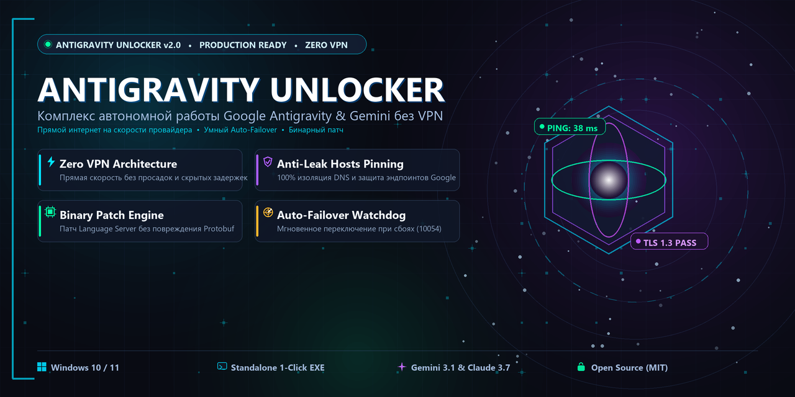
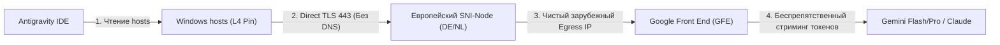

<div align="center">



# 🚀 Antigravity Unlocker 2.0
### Полноценный комплекс для автономной работы Google Antigravity, Antigravity IDE и моделей Gemini в РФ без VPN

[](https://microsoft.com)
[](https://python.org)
[](#)
[](#)
[](LICENSE)

[**Быстрый запуск**](#-быстрый-запуск-в-1-клик) • [**Возможности**](#-ключевые-возможности) • [**Архитектура**](#-архитектура-и-защита) • [**Карта кода**](docs/CODE_MAP.md) • [**Безопасность**](docs/SECURITY.md) • [**FAQ**](docs/FAQ.md)

</div>

---

## 📌 О проекте

**Antigravity Unlocker** — комплекс системной маршрутизации, изоляции DNS и бинарного патчинга для обеспечения беспрепятственной работы **Google Antigravity IDE**, CLI-утилиты `agy`, языкового сервера (`language_server.exe`) и моделей **Gemini / Claude** в условиях географических ограничений РФ/РБ.

### Главный принцип — Zero VPN:
* 🚀 **Прямой интернет на полной скорости провайдера** для браузера, YouTube, игр, торрентов и мессенджеров.
* 🛡️ **Маршрутизируются только модельные запросы** к Google AI через проверенные зарубежные SNI-узлы без перегрузок и скрытых подписок.

---

## ✨ Ключевые возможности

| Функция | Описание |
| :--- | :--- |
| ⚡ **Anti-Leak Hosts Pinning** | Принудительная привязка модельных эндпоинтов Google в `hosts` (100% защита от утечек в российские IP Google `172.217.x.x`). |
| 🐕 **Smart Auto-Failover Watchdog** | Фоновый мониторинг порта 443. При сбоях (`10054 WSAECONNRESET`) автоматически переключает `hosts` на резервный живой узел за доли секунды. |
| 🧬 **Длина-сохраняющий бинарный патч** | Модификация Language Server (`ineligible` ➔ `inexigible`, ровно 10 байт) без повреждения структуры PE и Protobuf. |
| ☁️ **Cloudflare Worker L7 Relay** | Встроенный перехватчик эндпоинта `:loadCodeAssist` для снятия региональных ограничений профиля Google. |
| 🛡️ **Автоматические бэкапы** | Создание контрольных точек с SHA-256 манифестом перед любыми изменениями и откат в 1 клик. |
| 🖥️ **Современный Dark GUI** | Графический интерфейс с живым дашбордом, замером пинга, логами и автозапросом UAC. |

---

## 🖥️ Быстрый запуск в 1 клик

### 📦 Вариант 1: Готовый Standalone `.exe` (Без установки Python)
Скачайте готовый исполняемый файл из папки **[`release/AntigravityUnlocker.exe`](release/AntigravityUnlocker.exe)** (или раздела [Releases](https://github.com)):
1. Запустите **`AntigravityUnlocker.exe`** (он автоматически запросит права Администратора через встроенный манифест UAC).
2. Нажмите **«⚡ АКТИВИРОВАТЬ АНЛОК»**.

---

### 🐍 Вариант 2: Графический интерфейс из исходного кода (GUI)
1. Запустите лаунчер **[`Запустить_Анлокер.bat`](Запустить_Анлокер.bat)** (или выполните `python gui.py`).
2. Нажмите большую зеленую кнопку **«⚡ АКТИВИРОВАТЬ АНЛОК»**.
3. Дождитесь успешного статуса на всех 4 индикаторах и откройте **Antigravity IDE**!

```
┌────────────────────────────────────────────────────────────────────────┐
│  🚀 Antigravity Unlocker 2.0            ● Права Администратора: ДА    │
├────────────────────────────────────────────────────────────────────────┤
│  [Бинарный патч]   [Привязка Hosts]   [Gemini API TLS]   [Приоритет]  │
│  ПРОПАТЧЕН [OK]    АКТИВЕН (Hetzner)  OK (450 ms)        IPv4 > IPv6  │
├────────────────────────────────────────────────────────────────────────┤
│  [⚡ АКТИВИРОВАТЬ АНЛОК]               [🔄 ПОЛНЫЙ ОТКАТ (ROLLBACK)]     │
│  [🛡️ Бэкап] [📁 Список] [⚡ Прокси] [🐕 Watchdog] [☁️ Cloudflare] [🔍] │
└────────────────────────────────────────────────────────────────────────┘
```

> **Примечание:** После активации окно программы **можно закрыть** — все настройки сохраняются в системе навсегда. Оставить свернутым имеет смысл для активной работы функции **Watchdog**.

---

### 💻 Вариант 3: Консольный режим (CLI)

```powershell
# Полная активация анлока (Бэкап + Hosts Pinning + Патч + Настройка IDE)
python tools/unlocker_core.py

# Комплексная диагностика сетевых маршрутов и бинарников
python tools/diagnostics.py

# Сканирование и бенчмарк пула прокси-серверов
python tools/proxy_manager.py

# Полный откат системы в исходное заводское состояние
python tools/unlocker_core.py --restore
```

---

## 🏛️ Архитектура и защита от инцидента 24–25 августа

### Что произошло 24–25 августа:
Публичные SmartDNS (`xbox-dns`, `111.88.96.50`) исключили зону `cloudcode-pa.googleapis.com` из таблиц подмены или ушли в таймаут (`os error 10054`). Служба Windows DNS при таймаутах каскадно опрашивала резервный резолвер из NRPT, получала реальный российский IP Google (`172.217.x.x`), кэшировала его, и запрос стриминга мгновенно блокировался по Geo-IP: `User location is not supported`.



### Как Antigravity Unlocker 2.0 решает это:
1. **Удаление утечек NRPT:** Скрипт очищает правила NRPT с адресами `111.88.96.50` и `83.220.169.155`.
2. **Hosts-Pinning с наивысшим приоритетом:** Домены зафиксированы в `hosts` — операционная система физически не может отправить DNS-запрос к провайдеру.
3. **Auto-Failover Watchdog:** Фоновый процесс проверяет здоровье узла. При сбое узел мгновенно заменяется на запасной из пула.

---

## 🔑 Обход блокировки Российских Google-Аккаунтов

Если при входе с российского Google-аккаунта возникает ошибка региона:

1. **Бинарный патч:** Программа автоматически патчит `language_server.exe` и `agy.exe`, заменяя литерал `ineligible` на `inexigible` (нейтрализует отказ на клиенте).
2. **Cloudflare Worker L7 Relay (Для 100% защиты):**
   - Разверните бесплатный воркер за 2 минуты с кодом из [`tools/cloudflare_worker.js`](tools/cloudflare_worker.js).
   - В интерфейсе нажмите **«☁️ Cloudflare L7 Relay»** и вставьте URL воркера.
   - Воркер на лету подменяет ответ Google `:loadCodeAssist` со статуса `INELIGIBLE` на `ALLOWED`.

---

## 📁 Структура репозитория

```
├── gui.py                      # Главная точка входа GUI
├── Запустить_Анлокер.bat       # Лаунчер с автозапросом UAC
├── PROJECT_RULES.md            # Спецификация и база знаний
├── README.md                   # Документация проекта
├── docs/                       # Расширенная документация
│   ├── ARCHITECTURE.md         # Глубокий технический разбор
│   └── FAQ.md                  # Ответы на частые вопросы
└── tools/
    ├── unlocker_core.py        # Ядро оркестрации и отката
    ├── proxy_manager.py        # Пул прокси, сканер и ProxyWatchdog
    ├── cloudflare_worker.js    # Шаблон Cloudflare Worker L7
    ├── backup_manager.py       # Менеджер резервных копий
    └── diagnostics.py          # Диагностический сканер
```

---

## 🔒 Безопасность и конфиденциальность

* **Сквозное шифрование:** Авторизация (`accounts.google.com`, `oauth2.googleapis.com`) идет по прямому TLS 1.3 каналу. Пароли и токены не проксируются.
* **100% обратимость:** Функция отката гарантированно возвращает файлы `hosts`, бинарники и настройки в исходное состояние.

---

<div align="center">

Создано с любовью для комфортной и свободной разработки в Antigravity.  
⭐ Поставьте звезду, если проект оказался полезным!

</div>
