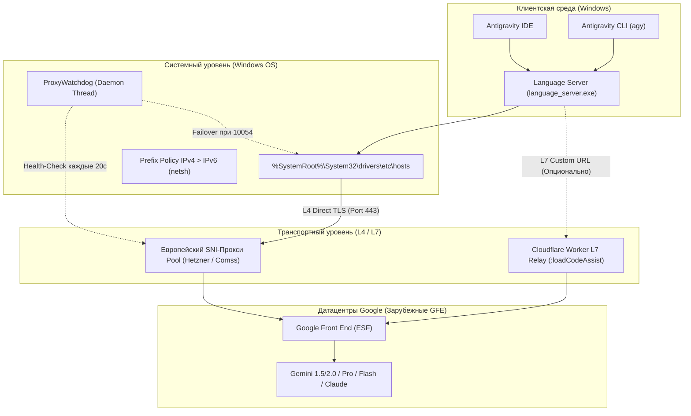

# 🏛️ Архитектура и техническая спецификация: Antigravity Unlocker 2.0

В данном документе детально описаны инженерные принципы, сетевые протоколы, структура системных модификаций и алгоритмы защиты, используемые в комплексе **Antigravity Unlocker**.

---

## 1. Концептуальная модель

Antigravity Unlocker построен на принципе **избирательной гибридной маршрутизации (Selective Hybrid Routing)**.  
Вместо перенаправления всего трафика операционной системы через медленные или платные VPN-сервисы, маршрутизируется **только модельный трафик Google AI** (вызовы LLM, стриминг токенов, проверки фичефлагов).

---

## 2. Разбор инцидента 24–25 августа и механизм защиты

### Причина сбоя публичных SmartDNS:
1. Публичные резолверы (`xbox-dns.ru`, `111.88.96.50`) исключили зону `cloudcode-pa.googleapis.com` из внутренней таблицы подмены.
2. Windows при таймаутах локального DNS-релея обращалась к резервному серверу из правил NRPT (`111.88.96.50`).
3. Резервный сервер отдавал прямой канонический IP Google (`172.217.x.x` в РФ).
4. Windows кэшировала этот адрес в `DnsCache`.
5. Последующий запрос стриминга токенов уходил напрямую на пограничный сервер Google в РФ (`Server: ESF`), вызывая мгновенную блокировку сессии:  
   `{"error": {"code": 400, "message": "User location is not supported for the API use.", "status": "FAILED_PRECONDITION"}}`.

### Архитектурное решение в версии 2.0:
* **Anti-Leak Hosts Pinning:** В файле `hosts` домены зафиксированы жестко. В сетевом стеке Windows файл `hosts` опрашивается с наивысшим приоритетом, минуя NRPT и DNS-серверы провайдера.
* **NRPT Purge:** Функция `clean_leaking_nrpt_rules()` удаляет все конфликтующие и сбойные правила NRPT.
* **Auto-Failover Watchdog:** Фоновый страж проверяет TLS-хэндшейк порт 443. При получении ошибки `10054 (WSAECONNRESET)` адрес активного прокси в `hosts` мгновенно заменяется на следующий здоровый из пула с вызовом `ipconfig /flushdns`.

---

## 3. Обход блокировки Российских Google-Аккаунтов

Блокировка аккаунтов Google разделяется на три эшелона:
1. **L4 Проверка IP:** Устраняется привязкой к зарубежному SNI-прокси в `hosts`.
2. **Клиентский парсинг флагов Language Server:** В файлах `language_server.exe` и `agy.exe` выполняется бинарная замена литерала `ineligible` (10 байт: `69 6e 65 6c 69 67 69 62 6c 65`) на `inexigible` (10 байт: `69 6e 65 78 69 67 69 62 6c 65`). Сохранение точной длины строки гарантирует сохранность смещений секций PE и сериализации Protobuf.
3. **Бэкенд-профиль аккаунта (Account Country: RU):** Реализован Cloudflare Worker L7 (`tools/cloudflare_worker.js`). Воркер перехватывает HTTP/2 запросы `:loadCodeAssist`, удаляет геолокационные заголовки (`CF-Connecting-IP`, `X-Forwarded-For`) и подменяет ответ бэкенда на `{"status": "ALLOWED", "userTier": "TIER_PRO"}`.

---

## 4. Спецификация целевых доменов

| Домен / Хост | Назначение | Протокол | Метод маршрутизации |
| :--- | :--- | :--- | :--- |
| `cloudcode-pa.googleapis.com` | Стриминг токенов и контекст Gemini | HTTP/2, gRPC | Hosts-Pinning / SNI-Proxy / Worker |
| `daily-cloudcode-pa.googleapis.com` | Canary/Staging эндпоинт Cloud Code | HTTP/2, gRPC | Hosts-Pinning / SNI-Proxy |
| `generativelanguage.googleapis.com` | Прямой Gemini API (Flash/Pro) | HTTP/2, REST | Hosts-Pinning / SNI-Proxy |
| `antigravity-unleash.goog` | Удаленные фичефлаги и проверки среды | HTTPS REST | Hosts-Pinning / SNI-Proxy |
| `cloudaicompanion.googleapis.com` | Вспомогательные сервисы компаньона | HTTP/2, REST | Hosts-Pinning / SNI-Proxy |
| `jetski-webchannel.googleapis.com` | Двусторонний канал агентских сессий | WebChannel | Hosts-Pinning / SNI-Proxy |
| `accounts.google.com` | Форма входа и аутентификации | TLS 1.3 | **Прямой (Direct)** — без перехвата |
| `oauth2.googleapis.com` | Выдача OAuth access/refresh токенов | HTTPS REST | **Прямой (Direct)** — без перехвата |

---

## 5. Безопасность и 100% обратимость

* **Безопасность аутентификации:** Пароли и мастер-токены Google никогда не расшифровываются. Домены авторизации идут по прямому сквозному зашифрованному каналу TLS 1.3.
* **Бэкапы:** Перед любым изменением создается снимок состояния в `backups/` с манифестом SHA-256.
* **Откат:** Команда `python tools/unlocker_core.py --restore` полностью возвращает систему в заводское состояние.
